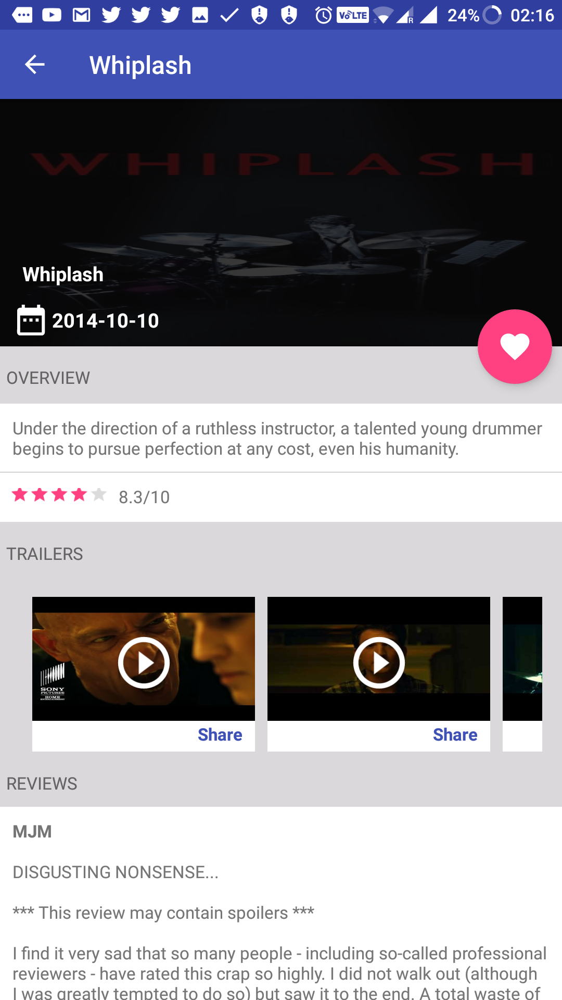

# popular_movies_stage_two_udacity
This project is developed for completion of Udacity popular movies satge 2

## Important
- To use this app register on [MoviesBD](https://www.themoviedb.org/account/signup) and get your api key and put it in app level gradle

```Java
 buildTypes {

        debug {
            buildConfigField "String", "api_key", '"your_api_key"'
        }
        release {
            minifyEnabled false
            proguardFiles getDefaultProguardFile('proguard-android.txt'), 'proguard-rules.pro'
        }
    }
```    
    
    

## Features
 - Ability to bookmark favourite movies
 - Offline viewing of favourite movie details
 - Handles different network situations
 - Ability to share details of movies
 - Maintain RecyclerView Scroll position on rotation
 - Use of content provider to manipulate SQlite data
 
 ## Built with
 
 [ButterKnife](http://jakewharton.github.io/butterknife/)
 [Retrofit](http://square.github.io/retrofit/)
 
 
## ScreenShots - Phone
<div style="display:flex;" >


